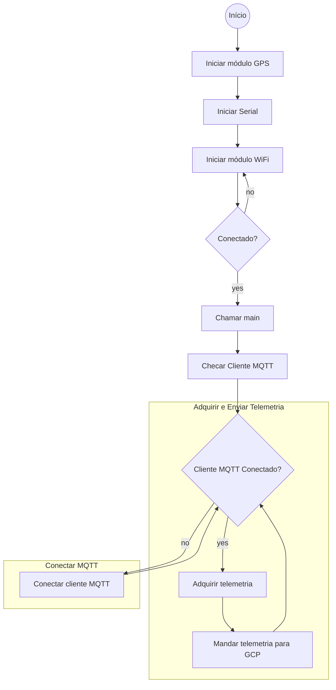

# Iniciativa Arduino IoT - IFRS Caxias do Sul - Catraca 4.0 – Internet do fim do mundo.
## Projeto de pesquisa - IMPLEMENTAÇÃO DA OFICINA INDÚSTRIA 4.0
Esse projeto utiliza uma Arduino Uno r3 com modulos: WiFi esp8266, GPS e dois botoes.

[TOC]

## Fluxograma da função main

##
   
    
