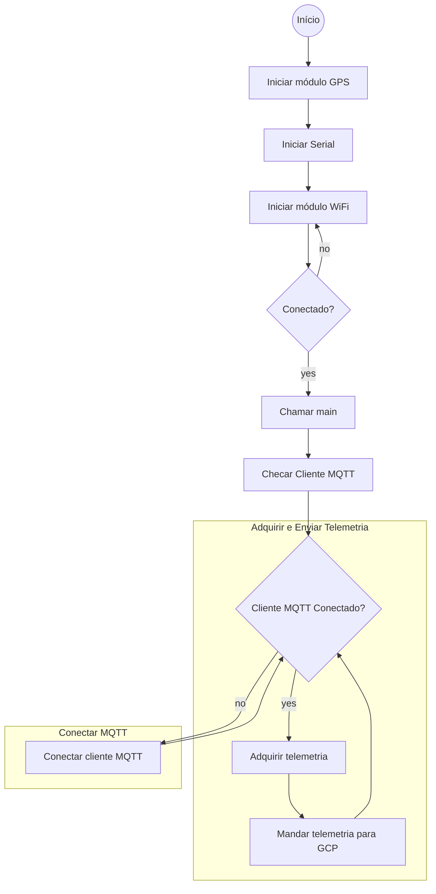

# Internet do fim do mundo - Catraca 4.0

Projeto de implementação da oficinas 4.0 no IFRS Campus Caxias do Sul.
>*~Equipe Iniciativa Arduino IoT*

## Abstract
Esse projeto utiliza uma Arduino Uno r3 com módulos: WiFi esp01 baseado no chip esp8266, GPS e dois botões. O protocolo de transmissão utilizado é o **Mosquito (MQTT)**  e o host para o backend é a **Google Cloud Platform** com os servicos de IoT Hub, e PUB/SUB.

>***Disclaimer***  
*Esse projeto pode causar cobranças e os autores não são responsáveis. Realize-o sob sua total consiência e leia o material disponível com atenção. Boa aprendizagem.*

---
**Tabela de conteúdo**

1. [Configurando a GCP](#configurando-a-gcp)
    
    1. [Fluxograma de fluxo das informações](#fluxo-de-informação)
    2. [Setup IoT Hub](#setup-iot-hub)
    3. [Setup Cloud Pub/Sub](#setup-cloud-pubsub)
    4. [Easy way - script de automação](#easy-way---script-de-automação)

2. [Configurando o Arduino Uno r3 e a ESP01](#configurando-o-arduino-uno-r3-e-a-esp01)

    1. [Instalando as bibliotecas na arduino IDE](#instalando-as-bibliotecas-na-arduino-ide)
    2. [Fluxograma da Função Main](#fluxograma-da-função-main)
    3. [Adaptando o código em C++](#adaptando-o-código-em-c)

3. [Testando a transferência de dados](#testando-a-transferência-de-dados)

    1. [Verificação do Cloud Pub/Sub](#verificação-do-cloud-pubsub)

4. [Routing e armazenamento de dados](#routing-e-armazenamento-de-dados)

    1. [Setup cloud functions](#setup-cloud-functions)
    2. [Setup DB](#setup-db)

5. [Construção da dashboard](#construção-da-dashboard)

    1. [*decidir ferramenta*](#decidir-ferramenta)

6. [Integraçao com aplicativo Móvel](#integraçao-com-aplicativo-móvel)

    1. [Desenvolvimento Ionic](#desenvolvimento-ionic)
---

## Configurando a GCP

A Google oferece vários serviços de cloud hosting nas mais variadas modalidades. Para mais informações sobre o free tier, acesse [este link](https://cloud.google.com/free/docs/gcp-free-tier#free-tier).

### Fluxo de informação

### Setup IoT Hub

### Setup Cloud Pub/Sub

### Easy way - script de automação

## Configurando o Arduino Uno r3 e a ESP01

### Instalando as bibliotecas na arduino IDE

### Fluxograma da função main

### Adaptando o código em C++

## Testando a transferência de dados

### Verificação do Cloud Pub/Sub

## Routing e armazenamento de dados

### Setup cloud functions

### Setup DB

## Construção da dashboard

### *~decidir ferramenta~*

## Integraçao com aplicativo Móvel

### Desenvolvimento Ionic
   
    
