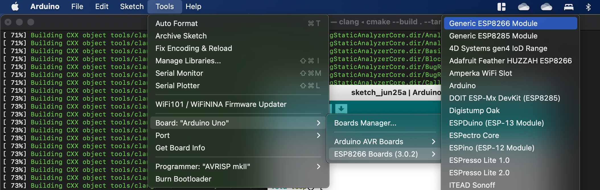
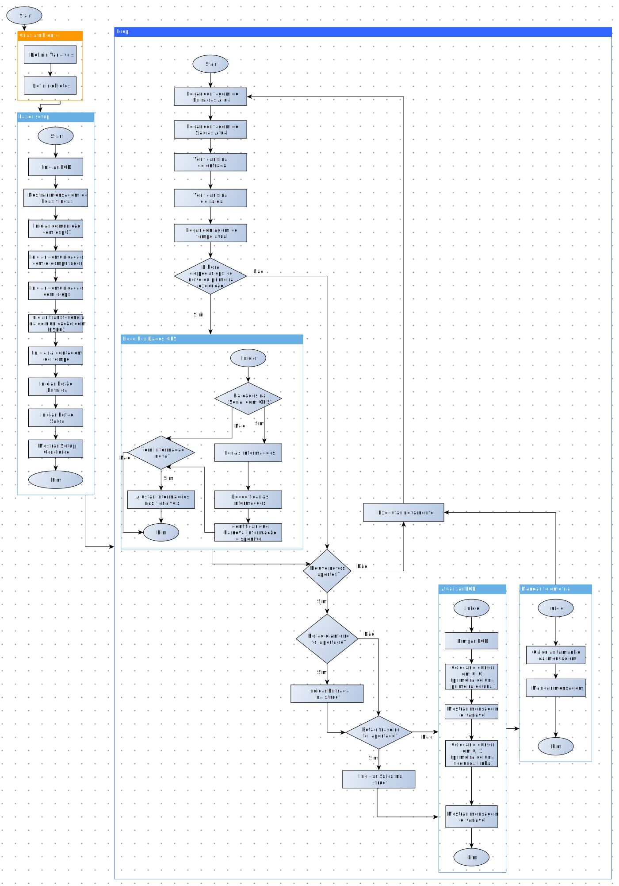
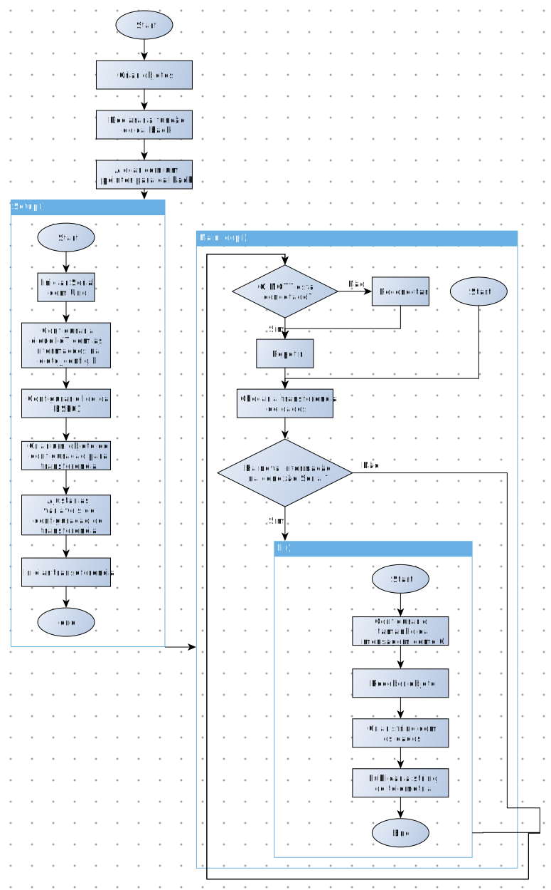
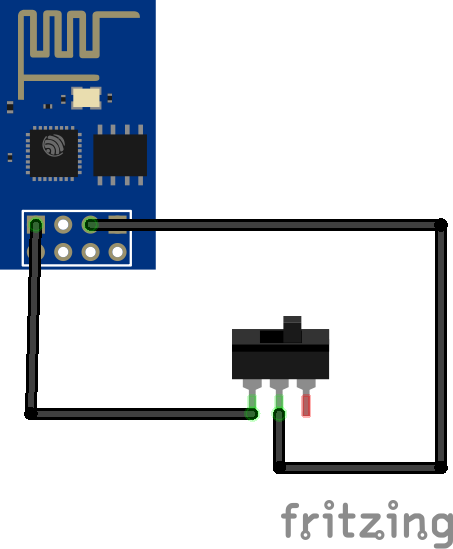
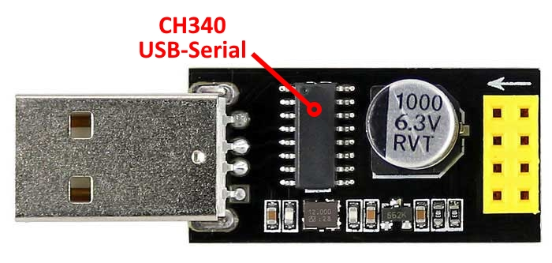
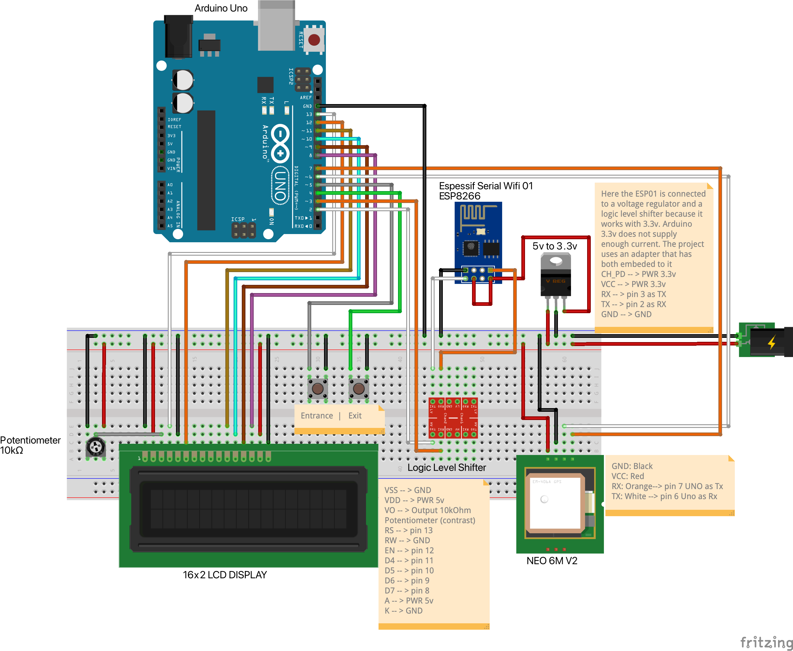
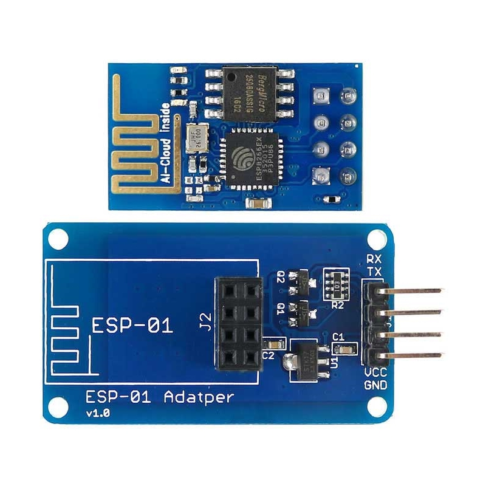
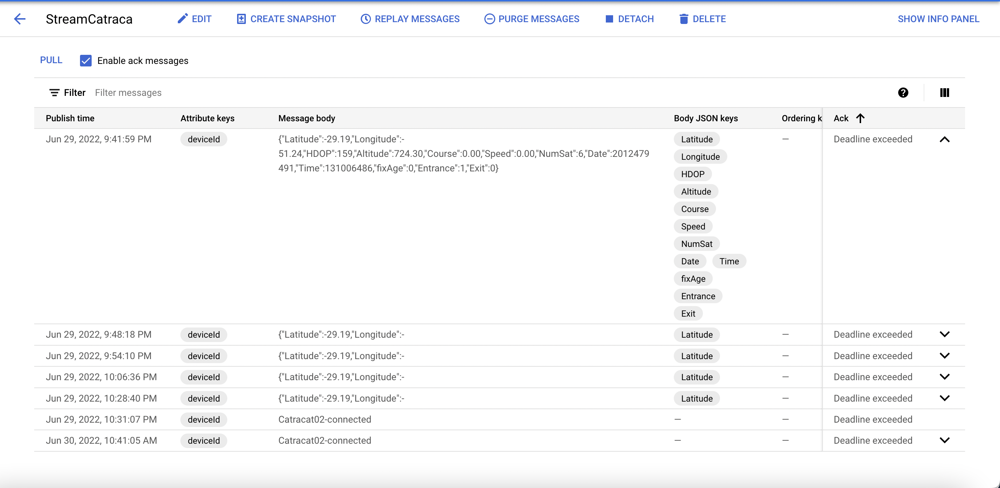

# Internet do fim do mundo - Catraca 4.0

Esse projeto faz parte da iniciativa de implementação das oficinas 4.0 no IFRS Campus Caxias do Sul.
>*~Equipe Iniciativa Arduino IoT* @eyji-koike @lu4nn3ry  
>*[Read this in English](./readmeEnUs.md)*  
>*[Lea esto en Español]()*  
## Abstract
O projeto utiliza uma Arduino Uno r3 com módulos: WiFi esp01 baseado no chip esp8266, GPS e dois botões. O protocolo de transmissão utilizado é o **[Mosquito (MQTT)](https://mosquitto.org/)**  e o host para o backend é a **[Google Cloud Platform](https://cloud.google.com/)** com os servicos de [IoT Core](https://cloud.google.com/blog/topics/developers-practitioners/what-cloud-iot-core), e [PUB/SUB](https://cloud.google.com/pubsub). Para nossa solução de retenção de dados, utilizamos um gatilho da [Google Cloud Functions](https://cloud.google.com/functions) que, quando acionado, manda os dados recebidos para o [Google Firebase](https://firebase.google.com/).
>***Disclaimer***  
*Esse projeto pode causar cobranças e os autores não são responsáveis. Realize-o sob sua total consiência e leia o material disponível com atenção. Boa aprendizagem.*

**Visão Geral**

O fluxo de informação vai ocorrer como representado na figura abaixo:  


**Lista de Materiais**

* Arduino Uno R3
* ESP01 8266
* GPS Neo 6M
* LCD 16x2
* Adaptador ESP01 com regulador de voltagem e trocador de nível 
* Potenciômetro 10kOhm
* Adaptador usb-serial ch340 para esp01
* Cabos jumper
* 2 botoeiras
* Fonte de alimentação 5v
* Interruptor (opicional) 
* Conta na Google Cloud Platform
* [Node package manager](https://nodejs.org/en/)
* [Microsoft VSCode](https://code.visualstudio.com/)
* [Gcloud CLI](https://cloud.google.com/sdk/docs/install)


**Tabela de conteúdo**

1. [Configurando a GCP](#configurando-a-gcp)
    
    1. [Setup IoT Core](#setup-iot-core)
    2. [Setup Cloud Pub/Sub](#setup-cloud-pubsub)
    3. [Easy way - script de automação](#easy-way---script-de-automação)

2. [Configurando o Arduino Uno r3 e a ESP01](#configurando-o-arduino-uno-r3-e-a-esp01)

    1. [Instalando as bibliotecas na arduino IDE](#instalando-as-bibliotecas-na-arduino-ide)
    2. [Fluxograma de código do Arduino Uno](#fluxograma-de-código---arduino-uno)
    3. [Fluxograma do código da ESP01](#fluxograma-de-código---esp01)
    4. [Conectando os componentes](#conectando-os-componentes)  
    5. [Montagem Final](#montagem-final)

3. [Dados, dados e mais dados](#dados,-dados-e-mais-dados)

    1. [Verificação do Cloud Pub/Sub](#verificação-do-cloud-pubsub)
    2. [Setup Firebase](#setup-firebase)
    3. [Setup cloud functions - Typescript](#setup-cloud-functions---typescript)
    4. [Setup cloud functions - Python](#setup-cloud-functions---python) 
    5. [Verificando o funcionamento da Cloud Function](#verificando-o-funcionamento-da-cloud-function) 

4. [Construção da dashboard](#construção-da-dashboard)

    1. [*decidir ferramenta*](#decidir-ferramenta)

5. [Integraçao com aplicativo Móvel](#integraçao-com-aplicativo-móvel)

    1. [Desenvolvimento Ionic](#desenvolvimento-ionic)
---

## Configurando a GCP

A Google oferece vários serviços de cloud hosting nas mais variadas modalidades. Para mais informações sobre o free tier, acesse [este link](https://cloud.google.com/free/docs/gcp-free-tier#free-tier). A configuração pode ser feita utilizando os menus, ou utilizando o shell. Há também um script que pode ser adaptado para tornar o provisionamento de estrutura automático.  
Primeiramente precisamos configar nomes para nossos serviços. Copie e cole as variáveis abaixo no seu bloco de notas, e preencha com o valor que achar adequado para seu projeto. Depois do preenchimento essas variáveis podem ser coladas diretamente no cloud shell, ou você pode utilizá-las como guia para preencher os campos nos menus do Google Cloud Console e demais aplicaçōes durante o projeto.  
```shell
export PROJECT_ID=      #insira o nome do projeto aqui
export REGION=          #insira a regiao aqui
export TOPIC_ID=        #insira a ID do topico pubsub aqui
export SUBSCRIPTION=    #insira a subscricao pubsub aqui
export REGISTRY=        #insira o nome do registro iot core aqui
export DEVICE_ID=       #insira a identificacao do dispositivo iot
```
Com seus nomes (ou identificões, se preferir) em mãos, podemos prosseguir para a próxima etapa. Crie um projeto com o mesmo nome que escolheu em **PROJECT_ID** e tenha certeza de que a Cobrança está ativada, caso contrário o Google não permitirá a criação das nossas ferramentas. Para fazer isso, basta acessar o Cloud Console e procurar por "Cobrança" ou "Billing" no menu de sanduíche que fica no lado esquerdo da tela. 

Para ativar os serviços necessários, va no menu à esquerda e selecione "APIs". No novo painel, aperte em adicionar serviços e APIs. Procure e ative **Cloud IoT, Pub/Sub e Cloud Functions**. Se quiser utilizar o shell, use o comando abaixo.  
```shell
gcloud services enable cloudiot.googleapis.com pubsub.googleapis.com cloudfunctions.googleapis.com
```  
Antes de iniciar a configuração dos serviços é necessário criar um conta para o serviço Cloud IoT pode publicar no PUB/SUB. Para isso, pesquise no menu por 
"IAM & Admin" e em IAM, aperte em "Adicionar". No primeiro campo, coloque o emails da nossa conta interna de serviço *cloud-iot@system.gserviceaccount.com* e em "Função" encontre a **Cloud PUB/SUB Publicador** e salve. Se estiver no Shell, use o comando abaixo.
```shell
gcloud projects add-iam-policy-binding $PROJECT_ID \
    --member=serviceAccount:cloud-iot@system.gserviceaccount.com \
    --role=roles/pubsub.publisher
```  
Também precisamos criar uma chave elíptica privada e uma pública de 256bits para autenticar nosso dispositivo. Aqui recomendamos que utilize o cloud shell pois também armazenamos ela no projeto.  
```shell
openssl ecparam -genkey -name prime256v1 -noout -out ec_private.pem
openssl ec -in ec_private.pem -pubout -out ec_public.pem
```
Agora vá em "Abrir editor" e ache suas chaves. Abra-as no editor e copie e cole em um arquivo de texto em lugar seguro para sua consulta posterior.   

>***Importante***  
>**Não compartilhe suas chaves com ninguém. Isso representa um risco a segurança e integridade do seu projeto.**  
### Setup Cloud Pub/Sub  

**Utilizando os menus**  
Para criar um [PUB/SUB](https://cloud.google.com/pubsub), pesquise na caixa do GCP por "Pub/Sub" ou role o menu em sanduíche até encontrar o serviço. Sua tela provavelmente estará em branco, então aperte no botão "Criar um Tópico". No novo menu que aparecerá, em "ID do tópico", coloque o nome definido anteriormente em **TOPIC_ID** e crie seu tópico. Após a mensagem de que o tópico foi criado com sucesso, no menu da esquerda vá em "Subescrições" e selecione "Criar Subescrição". Na nova tela aberta, coloque o nome que definiu em **SUBSCRITION** e selecione o nome do tópico que foi criado na etapa anterior. Aceite os valores pré-selecionados e crie a subescrição. 

**Utilizando o Shell**  
Para criar o IoT Core utilizando o shell, siga os seguintes comandos:  
```shell
gcloud iot registries create $REGISTRY \
    --region=$REGION \
    --event-notification-config=topic=$TOPIC_ID \
    --enable-mqtt-config --enable-http-config
 ```

### Setup IoT Core

**Utilizando os menus**  
Para criar um [IoT Core](https://cloud.google.com/blog/topics/developers-practitioners/what-cloud-iot-core), pesquise na caixa do GCP por "IoT Core" ou role o menu em sanduíche até encontrar o serviço. Sua tela provavelmente estará em branco, então aperte no botão "Criar um registro". No novo menu que aparecerá, em "ID do registro", coloque o nome definido anteriormente em **REGISTRY**, selecione a região definida em **REGION** (a dica é tentar deixar todos os seus serviços em uma única região ou regiões próximas. Para finalizar a configuração basta selecionar o tópico do menu Cloud Pub/Sub no qual deseja publicar as mensagens do dispositivo. Após criar o registro, va no menu "Dispositivos" e clique em "criar novo dispositivo". Adicione o nome desejado do seu dispositivo, que foi definido em **DEVICE_ID**. Abra as opções avançadas e role até autenticação. Coloque como método de entrada "Digitar manualmente" e para o formato selecione ES256. Logo abaixo, cole exatamente como copiou, incluíndo ---BEGIN PUBLIC KEY--- no começo e ---END PUBLIC KEY--- no final.

**Utilizando o Shell**  
Para criar o IoT Core utilizando o shell, siga os seguintes comandos:  
```shell
gcloud iot registries create $REGISTRY \
    --region=$REGION \
    --event-notification-config=topic=$TOPIC_ID \
    --enable-mqtt-config --enable-http-config
 ```
Para criar um dispositivo no nosso registro, utilize os comandos:  
```shell
gcloud iot devices create $DEVICE_ID \
    --region=$REGION \
    --registry=$REGISTRY \
    --public-key="path=./ec_public.pem,type=es256"
```

### Easy way - script de automação

Disponibilizamos um script shell para facilitar toda o setup da GCP para quem já tem maior afinidade com shell scripts. Não esqueça de modificá-los, substituindo os campos de acordo com suas definições. Baixe o script [aqui](./GCP/GCPScript.sh), abra o **cloud shell**. Em seguida abra o editor, clique em *fazer upload* e escolha seu arquivo. Para rodar digite:
```shell
./GCPScript.sh
```

## Configurando o Arduino Uno r3 e a ESP01

Em nosso sistema, o Arduíno Uno é o responsável por realizar a coleta dos dados de telemetria, equanto a ESP01 ficará responsável por mandar a telemetria via MQTT, conectar-se ao Access Point Wi-Fi e conectar-se ao GCP. Para realizar todas essas funções existem duas opções de desenvolvimento. Criar suas próprias bibliotecas de funções ou utilizar as que estão disponíveis na comunidade Arduino. A complexidade do projeto implicou na utilização de bibliotecas para otimizar o desenvolvimento do código de forma confiável. 


### Instalando as bibliotecas na arduino IDE

Como vamos realizar a programação da ESP01 no mesmo formato do Arduino UNO, precisamos fazer a Arduino IDE reconhecer a placa. Abra a Arduino IDE e vá em preferências. No campo "gerenciador de placas adicionais", insira o link abaixo:

```
https://arduino.esp8266.com/stable/package_esp8266com_index.json
```
Após dar um ok, vá em ferramentas, placa e Gerenciador de Placas. Na nova janela que abrir, procure por esp8266 por esp8266 community e instale. Agora, toda a vez que quiser programar para a ESP01, vá no mesmo menu de placas, vá em esp8266 e procure por esp8266 generic module. 

  

Para instalar as bibliotecas necessárias, va em skecth > incluir bibliotecas > gerenciar bibliotecas. Na janela que abrir, precisamos instalar as seguinte lista:

1. LiquidCrystal by Arduino
2. WifiESP by Bruno Portaluri
3. TinyGPS by Mikal Hart
4. SerialTransfer by PowerBroker2
5. MQTT by Joel Gaewhiler
6. Google Cloud IoT Core JWT by Guss Class
7. DailyStruggleButton by cygig

Se durante a instalação de alguma biblioteca uma mensagem de pop-up pedir a instalação de módulos extra, permita que sejam instalados.


### Fluxograma de código - Arduino Uno

No presente projeto, o Arduíno Uno funciona como um agregador de informação sensorial. Se algum botão foi pressionado durante o ciclo, o Uno busca definir qual botão foi pressionado para inserir em um *struct* que já contém as informações de GPS e é enviado para a ESP01 por uma porta Software Serial. O digrama de blocos fica da seguinte forma:
<p align="middle">

</p>
A versão explodida do loop() pode ser encontrada [aqui](/Assets/MainLoopExplodedPTBr.svg) caso mais detalhes sejam necessários. O código pode ser encontrado [aqui](/BoardPrograms/Uno/).


### Fluxograma de código - ESP01

O programa da ESP01 é relativamente mais simples. Quando o arduino Uno envia uma mensagem, a ESP01 aciona uma função que cria uma string no formato .JSON e envia para o PUB/SUB. A string tem o formato:

```json
 { 
    "latitude": 0.0000,
    "longitude": 0.0000,
    "HDOP": 0,
    "Altitude": 0.0000, 
    "Course": 0.0000,
    "Speed": 0.0000, 
    "NumSat": 0, 
    "Entrance": 0,
    "Exit": 0,
 }
```
O fluxograma de código da ESP01 fica mais simples, como apresentado abaixo e o código pode ser encontrado [aqui](./BoardPrograms/Esp8266-lwmqtt/).   
<p align="middle">

</p>
Vale lembrar que para fazer o upload do código, a ESP01 deve estar em modo de Flash. Para conseguir isso, o pino GPIO00 deve estar conectado ao GND quando a placa é conectada a enegia. Sugerimos a adição de uma fiação com interruptor entre os pinos GND e GPIO00 para facilitar o momento de programar a ESP01 como representado simplisticamente na figura a esquerda. Outra ferramenta que facilita bastante e foi utilizada neste projeto é o adaptador usb ch340 para esp01, mostrado na figura a direita.  
<p align="middle">


</p>

### Conectando os componentes    

O projeto utiliza grande parte das portas digitais do Arduino Uno. O esquema de fiação fica no formato apresentado na imagem abaixo.  
<p align="middle">
 
</p>
Repare que nesta configuração, utilizamos um  conversor de nível logico e um regulador de voltagem pois a ESP01 funciona com 3.3v tanto para os sinais nos pinos quando como VCC. Isso pode ser simplificado com a utilização do adaptador na imagem abaixo.  
<p align="middle">

</p>

### Montagem Final

No final, o projeto ficará como na imagem a seguir:
<p align="middle">


</p>

## Dados, dados e mais dados

Com nosso hardware pronto e funcional, podemos nos preocupar com a funcionalidade do solução de backend, pois até o momento só criamos a infraestrutura. Existem formas de testar o IoT Core, porém isso inclui a utilização de um cliente MQTT na sua máquina, bem como a criação de um dispositivo, um token jwt e uso dos certificados e vai além do escopo. Para mais informações, utilize [este projeto](http://nilhcem.com/iot/cloud-iot-core-with-the-esp32-and-arduino) by @nilhcem, na parte de "connect to http/mqtt bridge". 

### Verificação do Cloud Pub/Sub

Ligue todos os aparelhos. Se tudo estiver certo, ao pressionar um botão o Arduino Uno mostrará a contagem no display, e a luz azul da ESP01 piscará indicando o recebimento da comunicação serial. Para verificarmos se a informação chegou no tópico Pub/Sub, abra o Google Cloud Console e navegue até o serviço Pub/Sub. Clique na ID de tópico que criou e uma nova tela apareçerá. Procure pelo nome da **$SUBSCRIPTION** que criou e clique. Para ver as mensagens, selecione a checkbox "Enable ack messages" e clique em **pull**. Agora poderá verificar se a mensagem chegou com sucesso no tópico. Sua tela paracerá com isso:

<p align="middle">

</p>

Também é possivel utilizar a Cloud Shell. Para isso utilize o código abaixo. Esse comando funciona também na [Google Cloud CLI](https://cloud.google.com/sdk/docs/install-sdk).  

```shell
gcloud pubsub subscriptions pull --auto-ack $SUBSCRIPTION --limit=1
```

### Setup Firebase

Perfeito. Com nossos dados chegando na nuvem, temos que persistí-los em algum lugar pois o Pub/Sub apaga as mensagens conforme o tempo passa. Para isso vamos criar uma armazenamento no [Firebase](https://firebase.google.com/). Entre no website e faça login com a mesma conta da GCP. Vá em adicionar novo projeto e na hora de selecionar um nome, selecione **PROJECT_ID** igual ao da GCP. Confirme o plano **blaze**, confirme novamente. No passo de Google Analytics, confirme que o switch está em ativado pois precisaremos deste serviço e aperte próximo. Na conta do Google Analytics, selecione a conta padrão e confime, adicionar Firebase.  

Nosso projeto está configurado no Firebase, porém agora precisamos criar uma database Firestore e habilitar a cloud functions. No menu a esquerda, selecione Firestore Database e clique em criar database. Selecione o modo de teste, clique em próximo e na outra tela escolha uma região mais próxima da **REGION** escolhida para o projeto.


### Setup cloud functions - Typescript

Para construir nossa função, vamos utilizar o [node package manager](https://nodejs.org/en/), o microsoft [VSCode](https://code.visualstudio.com/) como IDE e precisaremos também do [gcloud CLI](https://cloud.google.com/sdk/docs/install). Utilize os links para instalar e configurar tudo na sua máquina. Em seguida instale os itens do Firebase com o comando:

```shell
npm install -g firebase-tools
```

Agora no seu computador, crie um diretório para nosso projeto, entre na pasta e inicie um projeto de functions:

```shell
mkdir meuProjeto
cd meuProjeto
firebase init functions
```
Utilize as setas para escolher "Use an existing project", depois selecione o nome do projeto da Google Cloud e, escolha TypeScript. Ainda temos mais umas perguntas para responder. Quando o menu perguntar sobre ESLint digite "n". Quando pergutar "Do you want to install dependencies?" digite "y" e em seguida digite o comando abaixo para abrir o projeto no VSCode
```
. code
```
Com o projeto aberto no VSCode, va na pasta **src** e abra o arquivo **index.ts**. Agora temos duas opções, é possível copiar e colar o código [deste link](./GCP/TSCloudFunction/index.ts) ou baixar o arquivo e substituir na pasta src. Modificação nas funções é possível para que atenda melhor ao caso de uso.
Utilize os comandos abaixo para entrar na sua conta da GCP e confirmar que está trabalhando no projeto correto:
```shell
gcloud auth login 
# abrirá o navegador para fazer login

gcloud projects list 
# mostra os projetos disponíveis

gcloud config set project $PROJECT_ID 
# adiciona o projeto atual (substitua o PROJECT_ID com o nome do projeto)
```

 Para finalizar, vamos utilizar o comando abaixo para fazer upload da nossa função:

```shell
firebase deploy --only functions
```
### Setup cloud functions - Python

A função que publica dados no *Firebase* pode ser feita também em python. A função fica mais simples e mais fácil de manter. Para começar, encontre o serviço *Cloud Functions* no console. No seu computador, crie uma pasta para o projeto usando os comandos

```shell
mkdir $PROJECT_ID
# nome do seu projeto

cd $PROJECT_ID
# entra na pasta do projeto

. code
# abre o VSCODE na pasta do projeto

```

Uma função python precisa de dois arquivos. Crie um arquivo *main.py* e um arquivo *requirements.txt*. No arquivo requirements, digite o seguinte:

```
google-cloud-firestore>=2.1.3
```

Isso configura que a versão mínima da biblioteca *Firestore* que presisa estar presente é a *`'2.1.3'`*.
Agora, você pode editar a *main.py*. Você pode copiar e colar, ou baixar o arquivo deste [link](./GCP/PythonCloudFunction/main.py) e substituir na pasta. Modifique de acordo com a necessidade. Para realizar o deployment utilize o seguinte commando:

```shell
gcloud functions deploy NOME_DA_FUNCAO --runtime python39 --trigger-topic $TOPIC_ID
```

### Verificando o funcionamento da Cloud Function  
Para verificar se está tudo correto, pressione alguma das botoeiras novamente ou publique uma mensagem no pubsub como:

```shell
gcloud pubsub topics publish $TOPIC_ID --message='Catracat02-connected' --attribute='deviceId=Catraca02,subFolder=events'

# ou

gcloud pubsub topics publish $TOPIC_ID --message='{"Latitude":-29.19,"Longitude":-51.24,"HDOP":159,"Altitude":724.30,"Course":0.00,"Speed":0.00,"NumSat":6,"Entrance":1,"Exit":0}' --attribute='deviceId=Catraca02'
```
Erros e eventos são listados no menu "Functions" na aba heatlh e logs.

## Construção da dashboard

### *~decidir ferramenta~*

## Integraçao com aplicativo Móvel

### Desenvolvimento Ionic
   
    
