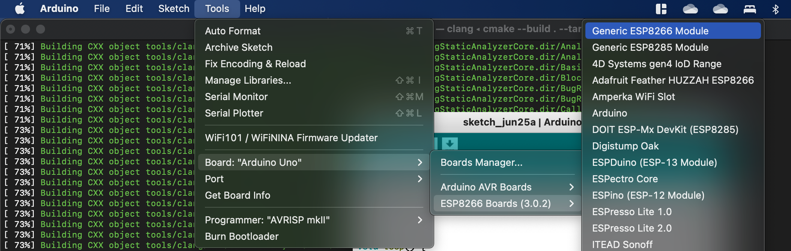
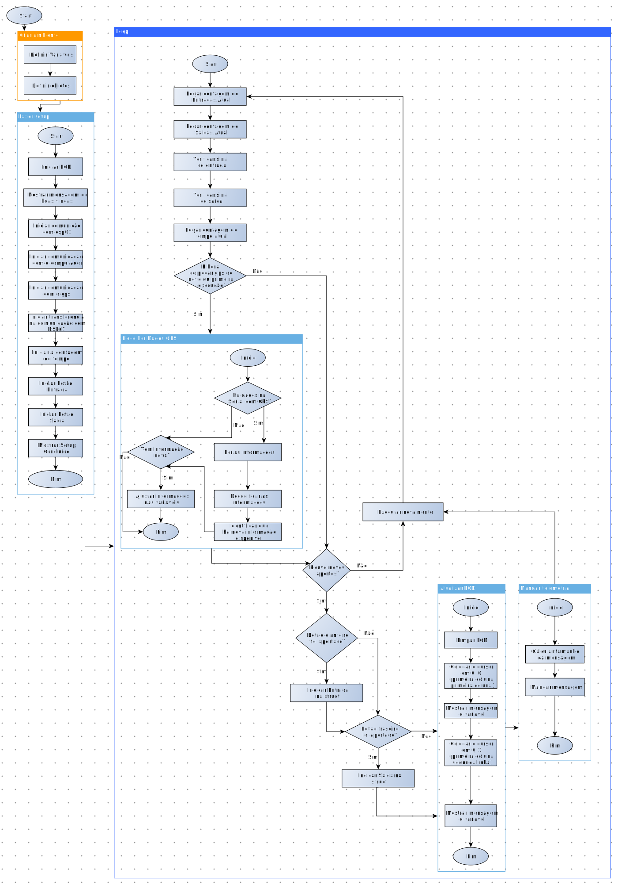
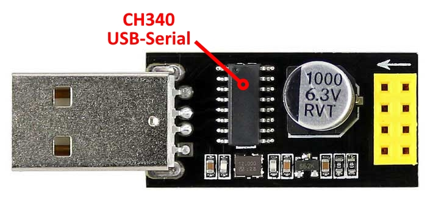
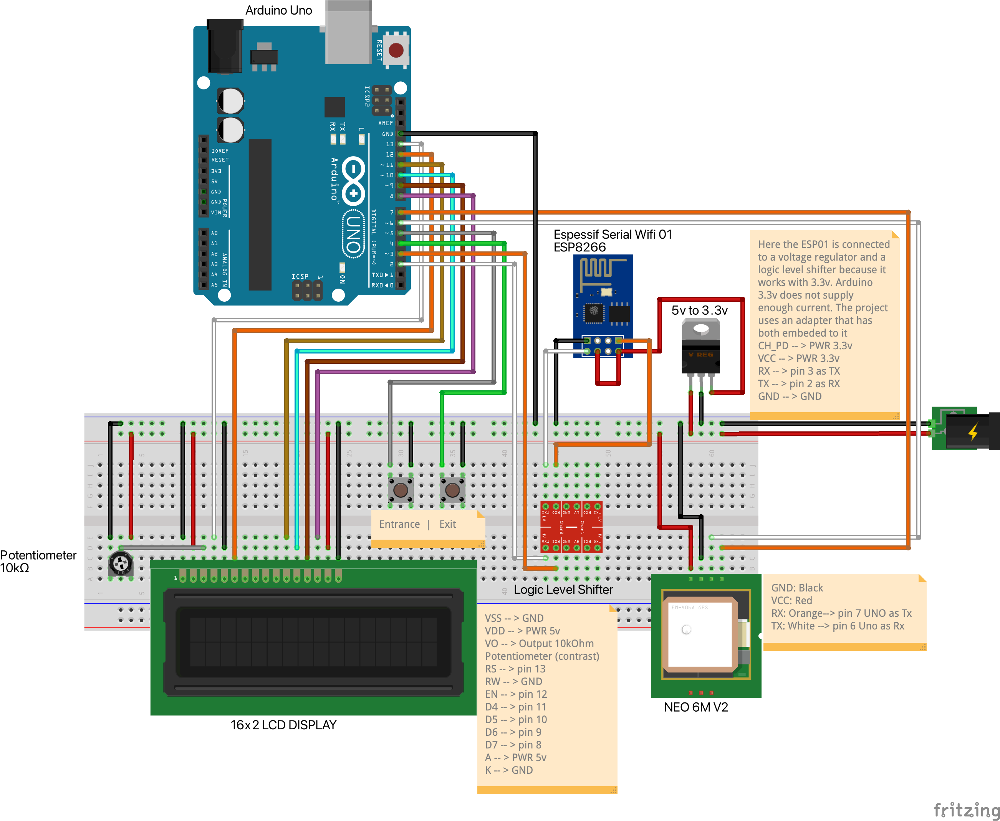
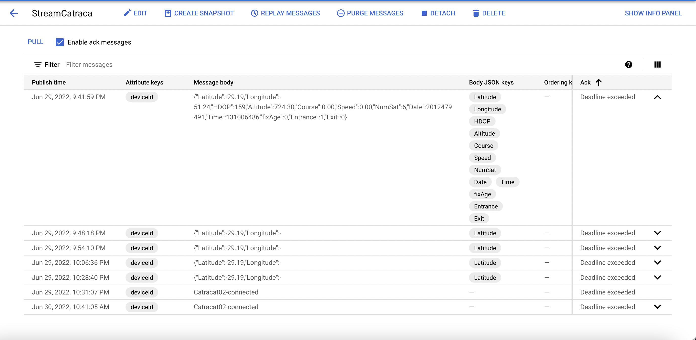

# Internet of the end of world - 4.0 Turnstile

Implementation project of 4.0 workshops at [IFRS Campus Caxias do Sul](https://ifrs.edu.br/caxias/).

> *~Team Iniciativa Arduino IoT  
> [Leia isso em Português](./readme.md)  
> [Lea esto en Español]()*

## Abstract  

This project uses an Arduino Uno r3 with WiFi esp01 based on the esp8266 chip, GPS, and two buttons. The transmission protocol used is **[Mosquito (MQTT)](https://mosquitto.org/)** and our backend is made on **[Google Cloud Platform](https://cloud.google.com/)** using the services [IoT Core](https://cloud.google.com/blog/topics/developers-practitioners/what-cloud-iot-core), and [PUB/SUB](https://cloud.google.com/pubsub). For our data retention, we use a [Google Cloud Functions](https://cloud.google.com/functions) that is triggered whenever a new publish PUB/SUB event happens, and sends the received data to [Google Firebase](https://firebase.google.com/).

>***Disclaimer***  
*This project may incur charges and the authors are not responsible. Do it under your full awareness and read the available material carefully. Have a Good learning experience.*

**Overview**

The figure below represents our data flux, with the services used.  


**Materials List**

* Arduino Uno R3
* ESP01 8266
* GPS Neo 6M
* LCD 16x2
* Adapter for ESP01 w/ voltage regulator and logic level shifter
* Potenciometer 10kOhm
* Adapter usb-serial ch340 for esp01
* Jumper Cables
* 2 push buttons
* 5v power supply
* Switch (optional)
* Account on Google Cloud Platform
* [Node package manager](https://nodejs.org/en/)
* [Microsoft VSCode](https://code.visualstudio.com/)
* [Gcloud CLI](https://cloud.google.com/sdk/docs/install)

**Table of Contents**

1. [Configuring GCP](#configuring-gcp)

    1. [Setup IoT Core](#setup-iot-core)
    2. [Setup Cloud Pub/Sub](#setup-cloud-pubsub)
    3. [Easy way - bash script](#easy-way---script-de-automação)

2. [Configuring Arduino Uno r3 and ESP01](#configurando-o-arduino-uno-r3-e-a-esp01)

    1. [Installing arduino IDE libraries](#instalando-as-bibliotecas-na-arduino-ide)
    2. [Arduino Uno code block](#fluxograma-de-código---arduino-uno)
    3. [ESP01 code block](#fluxograma-de-código---esp01)
    4. [Wiring](#conectando-os-componentes)  
    5. [Final assembly](#montagem-final)

3. [Data, data, and more data](#testando-a-transferência-de-dados)

    1. [Review Cloud Pub/Sub](#verificação-do-cloud-pubsub)
    2. [Setup Firebase](#routing-e-armazenamento-de-dados)
    3. [Setup cloud functions - Typescript](#setup-cloud-functions)
    4. [Setup cloud functions - Python](#setup-db)
    5. [Testing the cloud function]()

4. [Building the Dashboard](#construção-da-dashboard)

    1. [*find a suitable tool*](#decidir-ferramenta)

5. [Hybrid app integration](#integraçao-com-aplicativo-móvel)

    1. [Ionic](#desenvolvimento-ionic)

---

## Configuring GCP

Google offers many services in various ways. For more billing information on their free tier, click on [this link](https://cloud.google.com/free/docs/gcp-free-tier#free-tier). The configuration can be done utilizing the user interface, called console, or a command line interface as a free service called cloud shell. There is also a script at the end of this section, made for those who know how to execute it and make everything automaticaly.
Firstly we need to configure names for our stuff. Copy and paste the variables below on a notepad and fill it with what you find suitable. If you are going to use cloud shell, copy the filled version onto it but don't delete your file, as we are using it troughtout all the development.

```shell
export PROJECT_ID=      #fill with your project name
export REGION=          #choose a region
export TOPIC_ID=        #name of your pubsub topic
export SUBSCRIPTION=    #name of your pubsub subscription
export REGISTRY=        #name of your iot core regitry
export DEVICE_ID=       #iot device id
```

With everything on hand we can go to the next step. Create a project utilizing your **PROJECT_ID** and be sure to check if billing is activated, otherwise you will be prevente from proceeding when deploying any kind of service. To do that go to google cloud console and search for "billing" in the search bar.

To activate the necessary services, go to the menu at your top-left and find "APIs". Click on "add services and APIs", and then search and activate the following **IoT core, Pub/Sub, and Cloud Functions. If you are using shell, paste the following:

```shell
gcloud services enable cloudiot.googleapis.com pubsub.googleapis.com cloudfunctions.googleapis.com
```  

Before setting up the services, you need to create a service account to give IoT Core the permissions to publish into a Pub/Sub Topic. Search for "IAM & Admin" and when inside IAM, press "Add". On the first field, insert the following email *cloud-iot@system.gserviceaccount.com* and on the field "Function" search for **Cloud PUB/SUB Publish** and then hit save. If you are using shell, this will do it:

```shell
gcloud projects add-iam-policy-binding $PROJECT_ID \
    --member=serviceAccount:cloud-iot@system.gserviceaccount.com \
    --role=roles/pubsub.publisher
```  

To proceed, one will need an eliptic curve key pair with 256bits to authenticate the device. Now, it's easier to use cloud shell for that:

```shell
openssl ecparam -genkey -name prime256v1 -noout -out ec_private.pem
openssl ec -in ec_private.pem -pubout -out ec_public.pem
```

This will create two keys and save them in the cloud editor. Open the editor and find your keys. Open them, copy and paste into a temporary file for later. If you are using the shell you don't need to do this.

>***Important***  
>**Don't share your keys with anyone. This represents a security risk to the integrity of your project.**  

### Setup Cloud Pub/Sub  

**Utilizando os menus**  
To create a [PUB/SUB](https://cloud.google.com/pubsub), topic, in the GCP searchbox look for "Pub/Sub". You can also scroll until you find the service on the left-hand menu. Tap the button "Create topic". In the new window, fill in the "Topic ID" box with whatever you defined as **TOPIC_ID** and hit create. It might take a short while but a message will say when your topic has been created. Now go to "Subscriptions" and press "Create Subscription". In the new opened window, type in the name that you chose as **SUBSCRITION** and select the topic that we just created. Accept all default values and press Create.
**Utilizando o Shell**  
If you want to use the google shell, paste the following:  

```shell
gcloud iot registries create $REGISTRY \
    --region=$REGION \
    --event-notification-config=topic=$TOPIC_ID \
    --enable-mqtt-config --enable-http-config
 ```

### Setup IoT Core

**Using the GUI**  
To create a [IoT Core](https://cloud.google.com/blog/topics/developers-practitioners/what-cloud-iot-core), use the searchbox to look for "IoT Core" or browse the menu until you find it. When you opend it, your screen will probably be blank. Press "create registry". On the new page, type the registry name into **REGISTRY**, select the **REGION** (hint: try to leave all of them close to each other). To end the configuration, select the Cloud Pub/Sub topic that you wish to publish the device messages. After creating the registry, go in *devices* and click on "Create new Device". Add the **DEVICE_ID** on the name field. Now, open the advanced options and roll until you find "Authentication". Select "type manually" and for the format select ES256. Below that, copy and paste everthing including the ---BEGIN PUBLIC KEY--- and ---END PUBLIC KEY--- at the end.

**Using Shell**  
To create an IoT Core using shell:  

```shell
gcloud iot registries create $REGISTRY \
    --region=$REGION \
    --event-notification-config=topic=$TOPIC_ID \
    --enable-mqtt-config --enable-http-config
 ```

To create a device:  

```shell
gcloud iot devices create $DEVICE_ID \
    --region=$REGION \
    --registry=$REGISTRY \
    --public-key="path=./ec_public.pem,type=es256"
```

### Easy way - bash script

We made a shell script to make it easy to deploy all of the above infrastructure. Don't forget to modify it to suit your needs. Download it [here](./GCP/GCPScript.sh), and open **cloud shell**. Now open editor and hit "upload file". To run it:

```shell
./GCPScript.sh
```

## Configuring Arduino Uno r3 and ESP01

In this system the Arduino Uno is responsible for collecting the telemetry data, whereas the ESP01 will be responsible for sending the telemetry throught MQTT, connecting to the Wi-Fi Access Point and to GCP.  
There are two approaches to deal all inputs. We can build our own libraries or utilize the ones available. In this project we are using a bunch of libraries that can certainly do a solid job.

### Installing Libraries in Arduino IDE

To program the ESP01 we need to make the IDE recognize it. On the field "manage additional boards", input the following link:

```
https://arduino.esp8266.com/stable/package_esp8266com_index.json
```

Hit ok and go to tools > board > Boards Manager. In the new window, search for esp8266 community. You will need to do this every time to flash the esp8266. 

  

Para instalar as bibliotecas necessárias, va em skecth > incluir bibliotecas > gerenciar bibliotecas. Na janela que abrir, precisamos instalar as seguinte lista:

1. LiquidCrystal by Arduino
2. WifiESP by Bruno Portaluri
3. TinyGPS by Mikal Hart
4. SerialTransfer by PowerBroker2
5. MQTT by Joel Gaewhiler
6. Google Cloud IoT Core JWT by Guss Class
7. DailyStruggleButton by cygig

Se durante a instalação de alguma biblioteca uma mensagem de pop-up pedir a instalação de módulos extra, permita que sejam instalados.

### Fluxograma de código - Arduino UNO

No presente projeto, o Arduíno Uno funciona como um agregador de informação sensorial. Se algum botão foi pressionado durante o ciclo, o Uno busca definir qual botão foi pressionado para inserir em um *struct* que já contém as informações de GPS e é enviado para a ESP01 por uma porta Software Serial. O digrama de blocos fica da seguinte forma:
<p align="middle">

</p>
A versão explodida do loop() pode ser encontrada [aqui](/Assets/MainLoopExplodedPTBr.svg) caso mais detalhes sejam necessários. O código pode ser encontrado [aqui](/BoardPrograms/Uno/).

### Fluxograma de código - ESP01

O programa da ESP01 é relativamente mais simples. Quando o arduino Uno envia uma mensagem, a ESP01 aciona uma função que cria uma string no formato .JSON e envia para o PUB/SUB. A string tem o formato:

```json
 { 
    "latitude": 0.0000,
    "longitude": 0.0000,
    "HDOP": 0.0000,
    "Altitude": 0.0000, 
    "Course": 0.0000,
    "Speed": 0.0000, 
    "NumSat": 0, 
    "Entrance": 0,
    "Exit": 0,
 }
```

O fluxograma de código da ESP01 fica mais simples, como apresentado abaixo e o código pode ser encontrado [aqui](./BoardPrograms/Esp8266-lwmqtt/).
<p align="middle">

</p>
Vale lembrar que para fazer o upload do código, a ESP01 deve estar em modo de Flash. Para conseguir isso, o pino GPIO00 deve estar conectado ao GND quando a placa é conectada a enegia. Sugerimos a adição de uma fiação com interruptor entre os pinos GND e GPIO00 para facilitar o momento de programar a ESP01 como representado simplisticamente na figura a esquerda. Outra ferramenta que facilita bastante e foi utilizada neste projeto é o adaptador usb ch340 para esp01, mostrado na figura a direita.  
<p align="middle">


</p>

### Conectando os componentes

O projeto utiliza grande parte das portas digitais do Arduino Uno. O esquema de fiação fica no formato apresentado na imagem abaixo.  
<p align="middle">

</p>
Repare que nesta configuração, utilizamos um  conversor de nível logico e um regulador de voltagem pois a ESP01 funciona com 3.3v tanto para os sinais nos pinos quando como VCC. Isso pode ser simplificado com a utilização do adaptador na imagem abaixo.  
<p align="middle">

</p>

### Montagem Final

No final, o projeto ficará como na imagem a seguir:
<p align="middle">


</p>

## Dados, dados e mais dados

Com nosso hardware pronto e funcional, podemos nos preocupar com a funcionalidade do solução de backend, pois até o momento só criamos a infraestrutura. Existem formas de testar o IoT Core, porém isso inclui a utilização de um cliente MQTT na sua máquina, bem como a criação de um dispositivo, um token jwt e uso dos certificados e vai além do escopo. Para mais informações, utilize [este projeto](http://nilhcem.com/iot/cloud-iot-core-with-the-esp32-and-arduino) by @nilhcem, na parte de "connect to http/mqtt bridge".

### Verificação do Cloud Pub/Sub

Ligue todos os aparelhos. Se tudo estiver certo, ao pressionar um botão o Arduino Uno mostrará a contagem no display, e a luz azul da ESP01 piscará indicando o recebimento da comunicação serial. Para verificarmos se a informação chegou no tópico Pub/Sub, abra o Google Cloud Console e navegue até o serviço Pub/Sub. Clique na ID de tópico que criou e uma nova tela apareçerá. Procure pelo nome da **$SUBSCRIPTION** que criou e clique. Para ver as mensagens, selecione a checkbox "Enable ack messages" e clique em **pull**. Agora poderá verificar se a mensagem chegou com sucesso no tópico. Sua tela paracerá com isso:

<p align="middle">

</p>

Também é possivel utilizar a Cloud Shell. Para isso utilize o código abaixo. Esse comando funciona também na [Google Cloud CLI](https://cloud.google.com/sdk/docs/install-sdk).  

```shell
gcloud pubsub subscriptions pull --auto-ack $SUBSCRIPTION --limit=1
```

### Setup Firebase

Perfeito. Com nossos dados chegando na nuvem, temos que persistí-los em algum lugar pois o Pub/Sub apaga as mensagens conforme o tempo passa. Para isso vamos criar uma armazenamento no [Firebase](https://firebase.google.com/). Entre no website e faça login com a mesma conta da GCP. Vá em adicionar novo projeto e na hora de selecionar um nome, selecione **PROJECT_ID** igual ao da GCP. Confirme o plano **blaze**, confirme novamente. No passo de Google Analytics, confirme que o switch está em ativado pois precisaremos deste serviço e aperte próximo. Na conta do Google Analytics, selecione a conta padrão e confime, adicionar Firebase.  
Nosso projeto está configurado no Firebase, porém agora precisamos criar uma database Firestore e habilitar a cloud functions. No menu a esquerda, selecione Firestore Database e clique em criar database. Selecione o modo de teste, clique em próximo e na outra tela escolha uma região mais próxima da **REGION** escolhida para o projeto.

### Setup cloud functions

Para construir nossa função, vamos utilizar o [node package manager](https://nodejs.org/en/), o microsoft [VSCode](https://code.visualstudio.com/) como IDE e precisaremos também do [gcloud CLI](https://cloud.google.com/sdk/docs/install). Utilize os links para instalar e configurar tudo na sua máquina. Em seguida instale os itens do Firebase com o comando:

```shell
npm install -g firebase-tools
```

Agora, crie um diretório para nosso projeto, entre na pasta e inicie um projeto de functions:

```shell
mkdir meuProjeto
cd meuProjeto
firebase init functions
```

Utilize as setas para escolher "Use an existing project", depois selecione o nome do projeto da Google Cloud e, escolha TypeScript. Ainda temos mais umas perguntas para responder. Quando o menu perguntar sobre ESLint digite "n". Quando pergutar "Do you want to install dependencies?" digite "y" e em seguida digite o comando abaixo para abrir o projeto no VSCode

```
. code
```

Com o projeto aberto no VSCode, va na pasta **src** e abra o arquivo **index.ts**. Agora temos duas opções, é possível copiar e colar o código [deste link](./GCP/TSCloudFunction/index.ts) ou baixar o arquivo e substituir na pasta src. Modificação nas funções é possível para que atenda melhor ao caso de uso.
Utilize os comandos abaixo para entrar na sua conta da GCP e confirmar que está trabalhando no projeto correto:

```shell
gcloud auth login 
# abrirá o navegador para fazer login

gcloud projects list 
# mostra os projetos disponíveis

gcloud config set project $PROJECT_ID 
# adiciona o projeto atual (substitua o PROJECT_ID com o nome do projeto)
```

 Para finalizar, vamos utilizar o comando abaixo para fazer upload da nossa função:

```shell
firebase deploy --only functions
```

Para verificar se está tudo correto, pressione alguma das botoeiras novamente ou publique uma mensagem no pubsub como:

```shell
gcloud pubsub topics publish $TOPIC_ID --message='Catracat02-connected' --attribute='deviceId=Catraca02,subFolder=events'

# ou

gcloud pubsub topics publish $TOPIC_ID --message='{"Latitude":-29.19,"Longitude":-51.24,"HDOP":159,"Altitude":724.30,"Course":0.00,"Speed":0.00,"NumSat":6,"Date":2012479491,"Time":131006486,"fixAge":0,"Entrance":1,"Exit":0}' --attribute='deviceId=Catraca02'
```

Erros e eventos são listados no menu "Functions" na aba heatlh e logs.

## Construção da dashboard

### *~decidir ferramenta~*

## Integraçao com aplicativo Móvel

### Desenvolvimento Ionic
